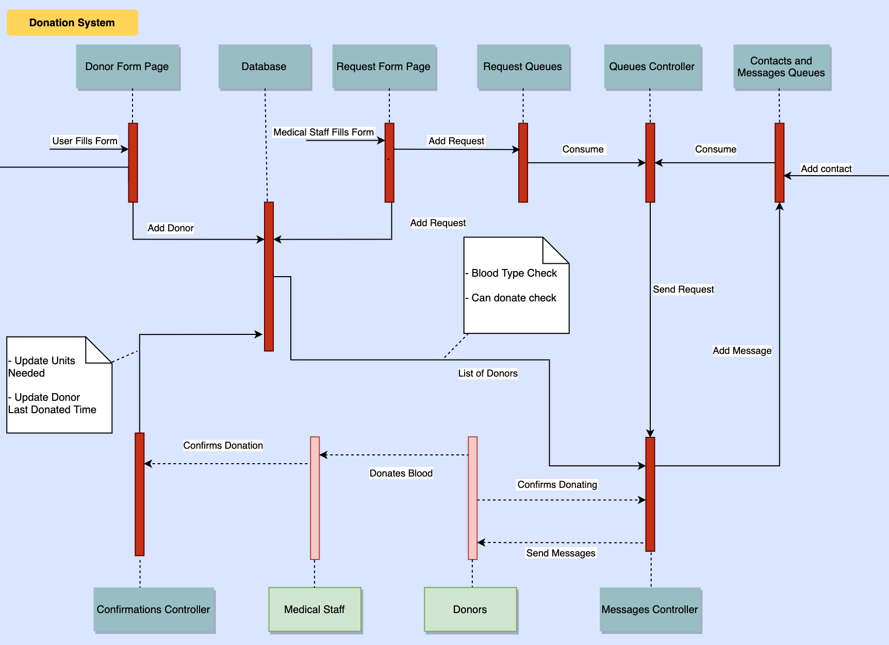

# Donation System
## The Idea  
This  project  aims  to  create  a  system  that  can  automate  the  blood  donation process  that  exists  in entities  
such as the Lebanese  Red  Cross. This  process is  currently  done  manually  and  we  believe  that  automating  it  would   
provide a faster and more efficient outcome that could prove to be paramount in life-threatening situations  
  
## Getting Started
To start working on the code, you'll need to clone the repo in your local directory.
1. Create a Python virtual environment for your Django project. This virtual environment allows you to isolate this project and install any packages you need without affecting the system Python installation. At the terminal, type the following command:

        $ virtualenv .venv

2. Activate the virtual environment:

        $ source ./venv/bin/activate

3. Install Python dependencies for this project:

        $ pip install -r requirements.txt

4. Migrate

        $ python manage.py migrate

Now, we need to run a rabbitmq server on port 5672. In the following steps, we will learn how to run a rabbitmq server using a docker container.  
  
- Install Docker  
- Run Docker
- Download a rabbitmq image `docker pull rabbitmq`  
- Check all images available using `docker images` and get the image id
- Run the rabbitmq docker image `docker run -d -p 5672:5672  IMAGEID`
- You can now see your running containers using `docker ps` and its container id
- Once you define your queues you can see the number of objects in them by first accessing the image command line using `docker exec -it CONTAINERID /bin/sh` then `rabbitmqctl list_queues`
- To start consuming objects from the blood queues, run the blood_queues and don't forget to specify the env variable `DJANGO_SETTINGS_MODULE=DonationSystem.settings` in the run configuration
- To start consuming objects from the telethon queues, run the telethon_queues and don't forget to specify the env variable `DJANGO_SETTINGS_MODULE=DonationSystem.settings` in the run configuration
- To start answering to telegram messages, run the messages_response and don't forget to specify the env variable `DJANGO_SETTINGS_MODULE=DonationSystem.settings` in the run configuration
  
## Components
### Donor form  
The document that people who want to add their names to the database will fill.  
### Request form  
The document that the medical staff will fill for a peron in need of blood to generate a request.  
### Queues of requests
This data structure is a message broker used to pass our requests to our messages_controller.
Each blood type will have a specific queue.
### Queues of Contacts and Messages
This data structure is a message broker used to pass contacts to be added and messages to be sent. 
### Database  
We have 2 models(tables): one for the donors and one for the requests.
The requests will be temporarily stored in the DB until they are fulfilled. In the meantime, we are able to check
the remaining number of units needed and the number of donors that confirmed that they will be donating.    
## Flowchart  
  
  
#### Fixtures  
Fixtures are used to dump and load dummy data.
- Dump Data from DB:

        $ python manage.py dumpdata BloodDonation.Donor > donors.json
- Load Data from JSON file:

        $ python manage.py loaddata donors.json