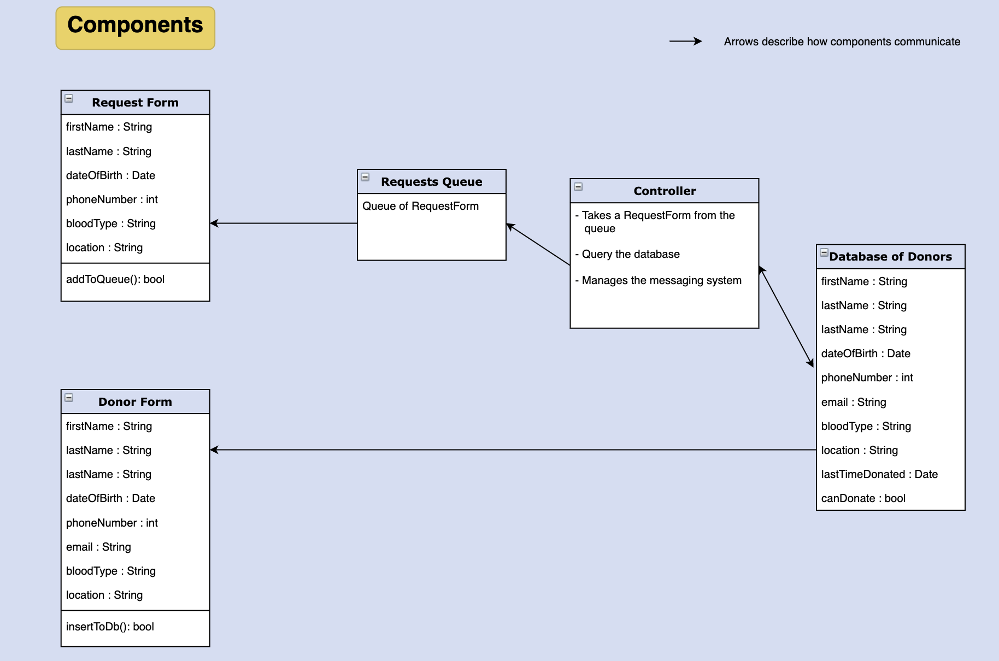

## The Idea  
This  project  aims  to  create  a  system  that  can  automate  the  blood  donation process  that  exists  in entities  
such as the Lebanese  Red  Cross. This  process is  currently  done  manually  and  we  believe  that  automating  it  would   
provide a faster and more efficient outcome that could prove to be paramount in life-threatening situations  
  
## Run locally  
We need to run a rabbitmq server on port 5672. In the following steps, we will learn how to run a rabbitmq server using a docker container.  
  
- Install Docker  
- Run Docker
- Download a rabbitmq image `docker pull rabbitmq`  
- Check all images available using `docker images` and get the image id
- Run the rabbitmq docker image `docker run -d -p 5672:5672  IMAGEID`
- You can now see your running containers using `docker ps` and its container id
- Once you define your queues you can see the number of objects in them by first accessing the image command line using `docker exec -it CONTAINERID /bin/sh` then `rabbitmqctl list_queues`
- To start consuming objects from the queues, run the queues_controller and don't forget to specify the env variable `DJANGO_SETTINGS_MODULE=DonationSystem.settings` in the run configuration
  
## Components  
  
### Donor form  
The document that people who want to add their names to the database will fill.  
### Request form  
The document that people in need of blood will fill out in order to generate a request.  
### Queue of requests  
This data structure should save the requests, so we don't lose any blood request.  
### Donors database  
This database holds the blood donors who will get picked for a request.  
## Flowchart  
  
  
#### Fixtures  
- python3 manage.py dumpdata BloodDonation.Donor > donors.json  
- python3 manage.py loaddata donors.json